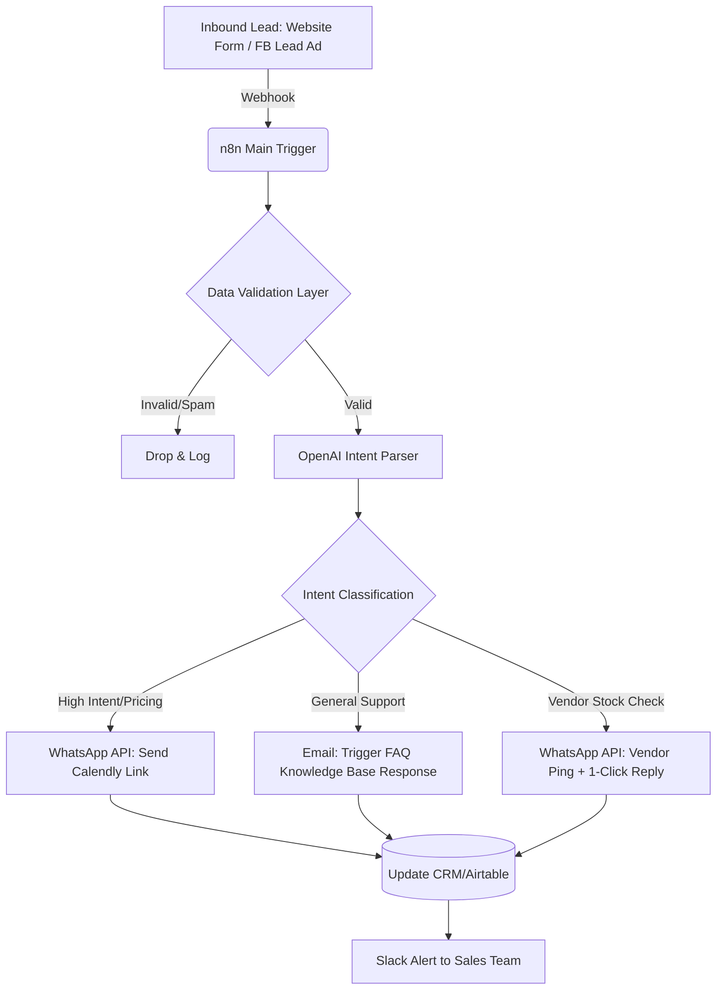

# Architecture: The 0-Latency Responder (Tier 1 Product)

**ICP:** B2B Agencies, Mid-Market Wholesalers, Real Estate brokerages.
**The Breach Solved:** Inbound leads languishing in email inboxes or generic WhatsApp chats, resulting in a 48% drop in conversion probability after 4 hours.
**The Solution:** An automated n8n webhook listener that catches inquiries, uses OpenAI to parse intent, and instantly replies via WhatsApp/Email with a calibrated response or booking link.

## Logic Flow (Mermaid)



## JSON Configuration Structure (n8n Node Mockup)

```json
{
  "name": "0-Latency-Responder-Core",
  "nodes": [
    {
      "parameters": {
        "httpMethod": "POST",
        "path": "lead-intake",
        "options": {}
      },
      "name": "Webhook Intake",
      "type": "n8n-nodes-base.webhook",
      "typeVersion": 1,
      "position": [250, 300]
    },
    {
      "parameters": {
        "model": "gpt-4o",
        "systemMessage": "You are a lead classifier for a B2B wholesaler. Categorize the user message into 'high_intent', 'support', or 'vendor_query'. Output strictly as JSON.",
        "prompt": "={{$json.body.message}}"
      },
      "name": "OpenAI Intent Node",
      "type": "n8n-nodes-base.openAi",
      "typeVersion": 1,
      "position": [450, 300]
    },
    {
      "parameters": {
        "conditions": {
          "string": [
            {
              "value1": "={{$json.message.intent}}",
              "value2": "high_intent"
            }
          ]
        }
      },
      "name": "Switch Logic",
      "type": "n8n-nodes-base.switch",
      "typeVersion": 1,
      "position": [650, 300]
    }
  ]
}
```

## Expected Delivery Economics
- **Setup Time:** 5-7 Days.
- **Client Value:** 0 missed leads, immediate response dopamine hit for prospect.
- **Price Tag:** $2,500.
