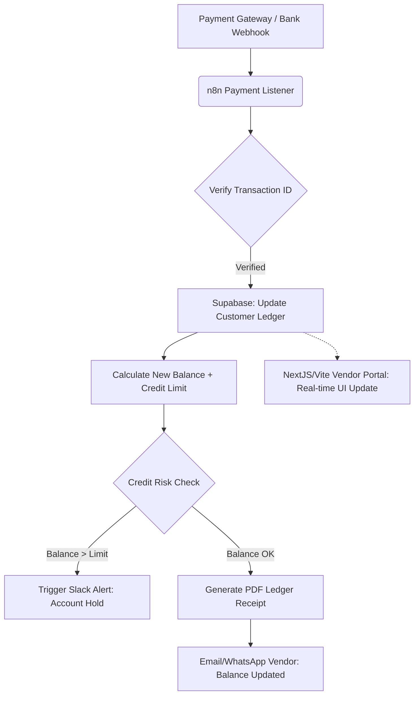

# Architecture: The Live-Ledger Bridge (Tier 2 Product)

**ICP:** B2B Manufacturers, Distributors, High-Volume Wholesalers.
**The Breach Solved:** Financial tracking managed in disconnected Excel sheets. Staff spends 20+ hours a week reconciling invoices with vendor credits.
**The Solution:** A unified logic engine that catches payment events (Stripe/Bank API), updates a central database (Supabase), and automatically pushes real-time ledger updates back to a secure client-facing portal.

## Logic Flow (Mermaid)



## JSON Configuration Structure (Supabase DB Schema)

```json
{
  "table": "customer_ledgers",
  "schema": {
    "ledger_id": "uuid PRIMARY KEY",
    "customer_id": "uuid FOREIGN KEY",
    "current_balance": "numeric(12,2) NOT NULL",
    "credit_limit": "numeric(12,2) NOT NULL",
    "last_transaction_date": "timestamp with time zone",
    "status": "enum('healthy', 'warning', 'hold')"
  },
  "rls_policies": [
    "Customers can only view their own ledger_id",
    "Admins have full CRUD access"
  ]
}
```

## Expected Delivery Economics
- **Setup Time:** 2-4 Weeks.
- **Client Value:** Eliminates 80 hours of manual bookkeeping per month; removes human error in credit extension.
- **Price Tag:** $5,000 - $8,000+.
